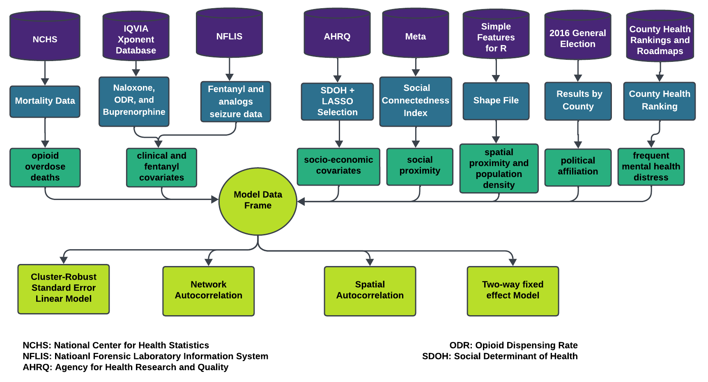

### OPIOID-SCI

This project offers a collection of R scripts designed to estimate the effect size of deaths within social proximity. These scripts utilize various statistical models, including linear regression, spatial error model, and two-way fixed effects, to conduct the analysis. Additionally, the scripts include guidance on how to extract data from data.census.gov using the "tidycensus" package. The project also encompasses detailed instructions on generating plots from the statistical models and exploratory analysis.

## getting started
- RStudio 2022.12.0+353 "Elsbeth Geranium" 

## model execution 
### linear model
The primary variables of interest, deaths in social proximity and deaths in spatial proximity, are defined as follows:
```math
y_i = \beta_0 + \beta_1 s_{-i} + \beta_2 d_{-i} + \overline{\beta_3}^T \overline{C}_i+ \overline{\beta_4}^T \overline{X}_i + \epsilon_i 
```

The variables s_{-i} and d_{-i} are defined as:
```math
s_{-i} = \sum_{j\neq i} w_{ij}y_{j},\; \text{and} \; d_{-i} =\sum_j a_{ij}y_{j},
```
where the social and spatial proximity weights are given by:
```math
w_{ij} = \frac{n_{j}\text{SCI}_{ij}}{\sum_{k\neq i} n_{k} \text{SCI}_{ik}}, \; \text{and} \;     
a_{ij} = \frac{1 + \frac{1}{d_{ij}}}{\sum_{k \neq i} (1 + \frac{1}{d_{ik}})}.
```
In the linear model $\overline{C}_i$ and $\overline{X}_i$ denotes the vector for clinical and socioeconomic covariates which acts as a control in our model. 

## data pre-processing


The diagram shows the data pipeline for OOD, along with the streams for the primary variable of interests $s_{-i}$ and $d_{-i}$, representing the relevant socioeconomic and clinical covariates, respectively. 

## visualization
* Exploratory maps are generated from the R scrpit "pa_ood_2018_2019_figures"
* The confidence interval plots and scatter plot matrix are generated from the r-script "coefficient_plot_for_models". The script also entails the regression tables.

## data availability statement
Mortality data was obtained from the National Center for Health Statistics (NCHS). Due to confidentiality concerns, this data set is not publicly accessible, but can be requested from NCHS at https://www.cdc.gov/nchs/nvss/nvss-restricted-data.htm. The clinical covariates were sourced from the IQVIA Xponent database, which is also not publicly available. Access can be requested through IQVIA at https://www.iqvia.com/insights/the-iqvia-institute/available-iqvia-data. Data on illicit fentanyl-related drugs were obtained from the National Forensic Laboratory Information System (NFLIS) and can be accessed at https://www.nflis.deadiversion.usdoj.gov. The social determinants of health (SDOH) covariates are available from the Agency for Healthcare Research and Quality (AHRQ) at https://www.ahrq.gov/sdoh/data-analytics/sdoh-data.html. The Social Connectedness Index data can be accessed through the Facebook Data for Good tools at https://dataforgood.facebook.com/dfg/tools/social-connectedness-index.

